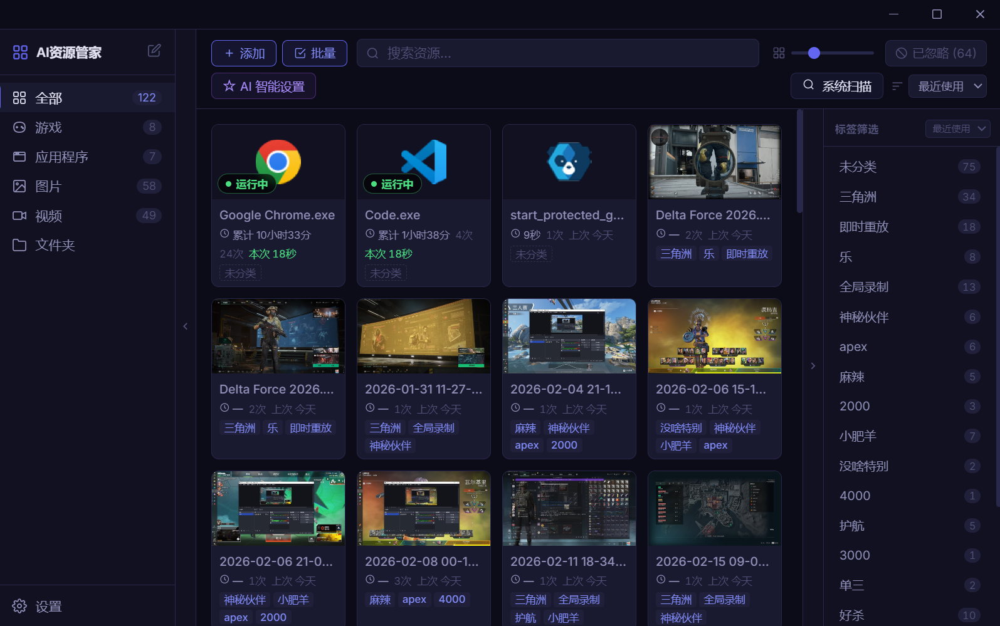
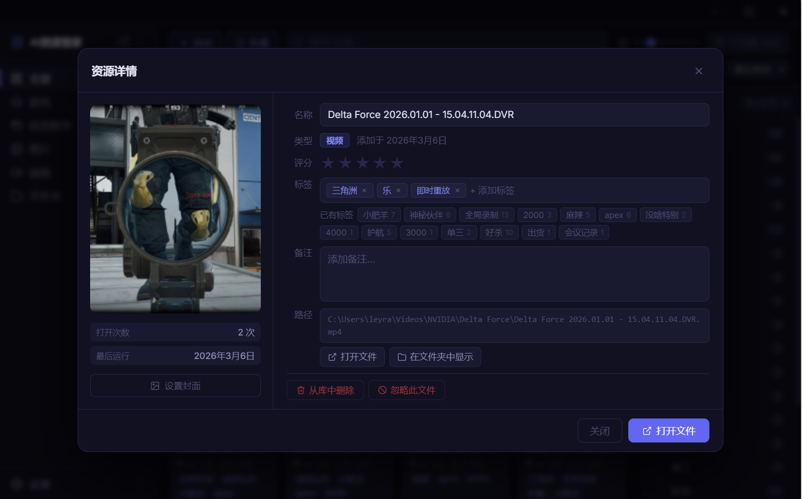
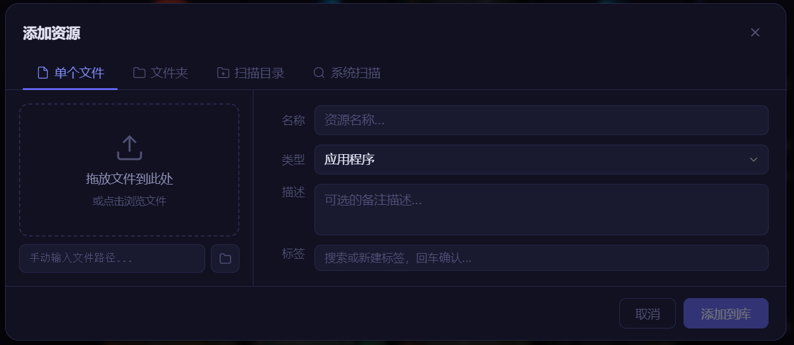
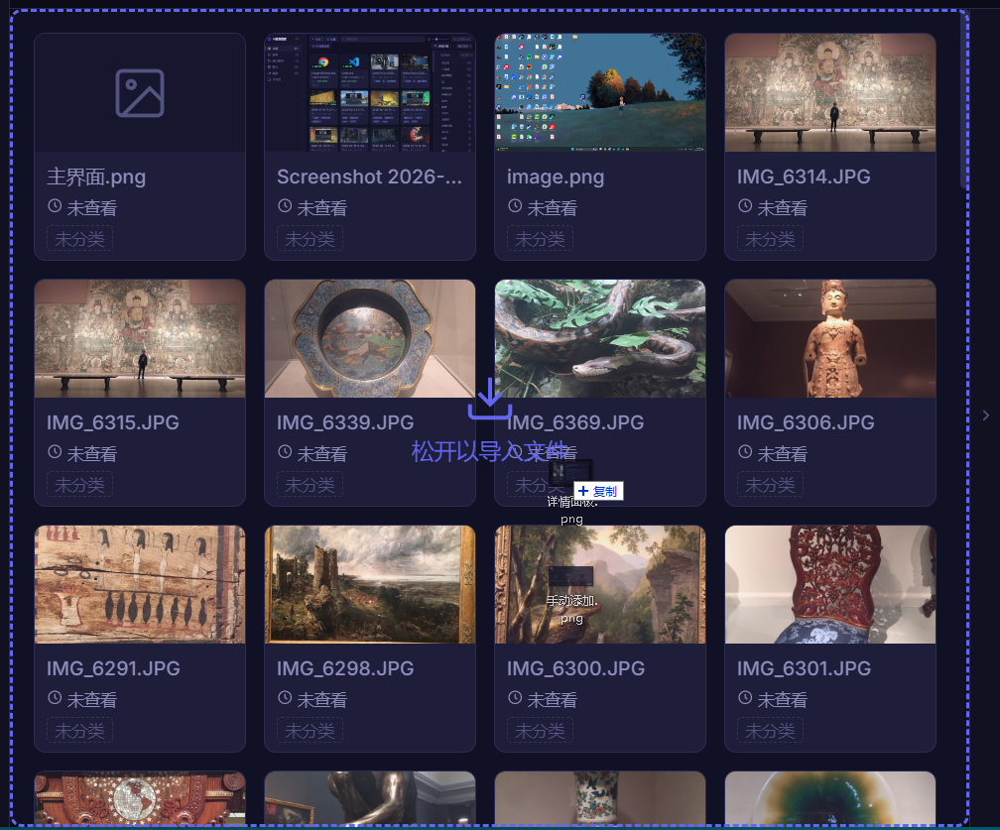
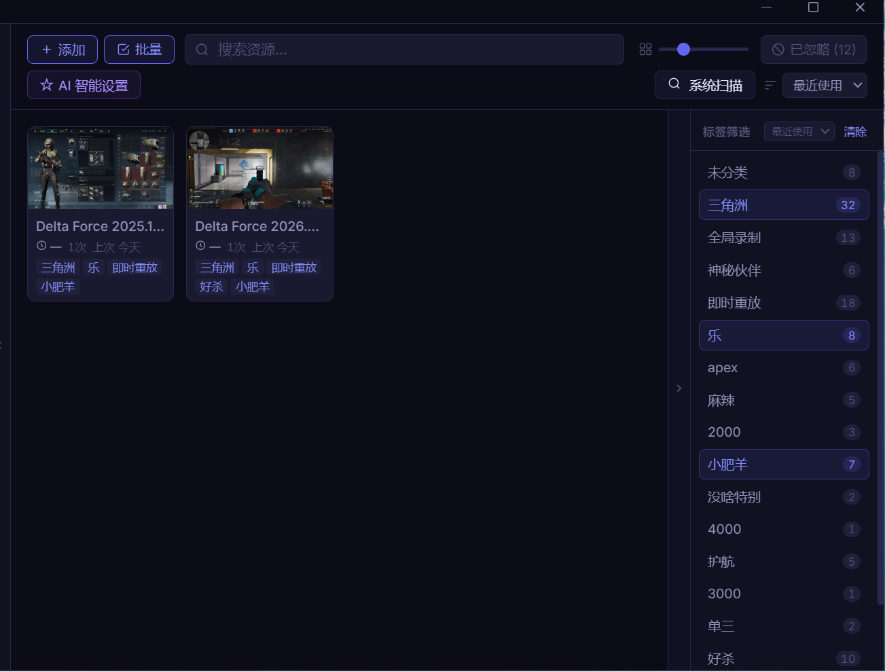
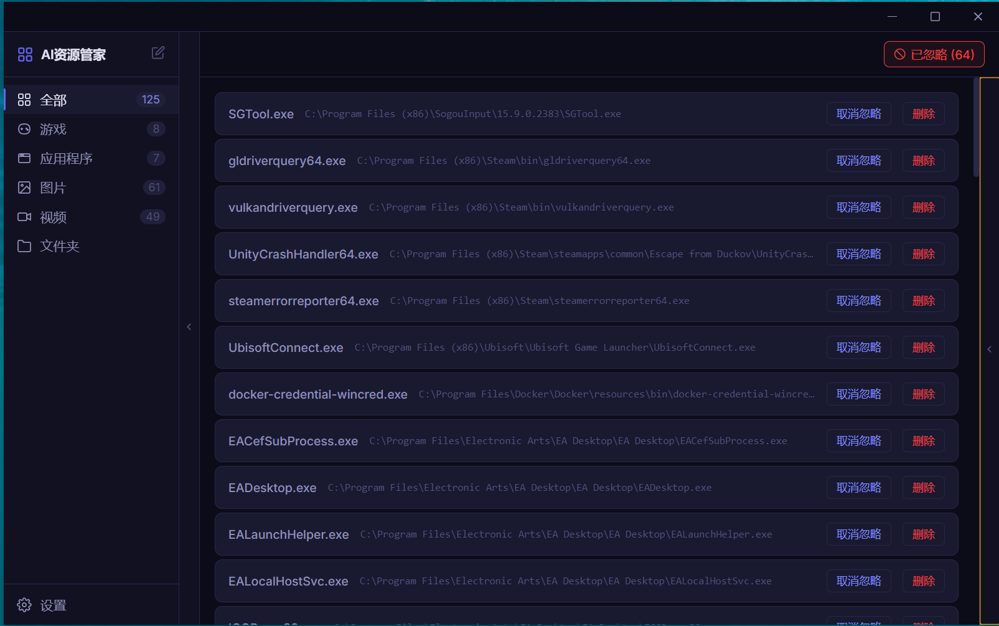

<p align="right">
  <b>中文</b> | <a href="README.md">English</a>
</p>

<p align="center">
  
</p>

<h1 align="center">AI小抽屉</h1>

<p align="center">
  <b>你用过的每个文件、每个程序，都能找回来。</b>
</p>

<p align="center">
  
  
  
</p>

---

<p align="center">
  
</p>

---

## 为什么需要它？

### 场景 1：桌面屎山

你的桌面堆满了文件、截图、安装包……每次找东西都要翻半天，看着就烦。
想整理？建文件夹分类要花整个下午，整理完不到三天又乱成一坨。
于是你再次放弃——然后下次找东西还是翻。

**用 AI小抽屉的做法：**
1. 在桌面新建一个文件夹，把满屏杂乱文件全选拖进去——桌面瞬间清空，极度解压
2. 把这个文件夹拖给资源管家，一键入库
3. 以后要找某个文件，直接在资源管家里搜，秒出

不需要分类，不需要建文件夹，桌面干净了，东西一个都没少。

### 场景 2：文件失忆

好不容易找到一个能修复受损 MP4 的工具，用了一次，问题解决了。半年后同样的事情又来了——这个工具叫什么？装在哪？完全想不起来了。

说的就是你，[WizTree](https://diskanalyzer.com/)——我 C 盘满了用来定位大文件的神器，名字死活想不起来，每次都得重新搜。

AI小抽屉在你正常用电脑的过程中，把你打开过的每个程序、每个文件全部静默记录。下次找它，就是搜一下的事。

### 养成系：用着用着就顺手了

一开始我也以为手动打标是伪需求——大家太懒，不会动。但实际调研后发现情况很微妙：**大家确实懒得理杂七杂八的文件，但对极少数高频核心文件，非常有打标的意愿。**

所以在 AI 完全接入之前，它现在的核心定位是一个**历史记录器**——属于越用越顺手的养成系。

你这次好不容易翻出了某个特定清理软件，找到后顺手打个标；软件也自动记录了你打开它这件事。下次再找它，就是一秒钟的事。每次找到都是一次沉淀，积累够了，你的"数字记忆"就真正活起来了。

---

## 核心能力

### 1. 自动记录，零配置

后台静默运行，自动记录你使用过的一切：

- **文件监听** — 你打开的图片、视频、文档，自动记录
- **桌面快捷方式** — 桌面上的游戏和应用，自动识别
- **进程检测** — 每一个你启动的程序，自动捕获

**不需要手动导入。正常用电脑，记录自动建好。**

当然，你也可以直接把文件或文件夹拖进窗口，一键导入。

### 2. 使用追踪

不只记录"用过什么"，还记录"怎么用的"：打开次数、累计运行时长、实时计时、上次打开时间。

三个月前玩的那个游戏，上周处理的那批照片——打开资源管家，一目了然。

### 3. AI 功能（即将上线）

**AI 大白话搜索** — 用自然语言描述你的记忆，不用想文件名：

- "我去年使用过的剪辑软件"
- "我昨天处理的文件"
- "上周老板发我的让我填的公司报表"
- "上周我们公司参展使用的 PPT"

**AI 智能分类** — 你只管用，AI 帮你整理：

- **照片** — 标注一张"加拿大，2018，尼亚加拉大瀑布"，AI 自动给剩下几百张打上对应标签
- **应用 & 游戏** — 一堆 exe 拖进来，AI 自动识别哪些是游戏、哪些是工具，分好类

---

## 与同类工具的区别

|  | AI小抽屉 | Everything | Playnite |
|---|:---:|:---:|:---:|
| 自动记录使用历史 | **自动记录** | 不追踪 | 不追踪 |
| 零配置 | 装上就用 | 只搜文件名 | 需配置插件 |
| 运行时长追踪 | **内置** | 无 | 需插件 |
| 全类型资源 | 游戏/应用/图片/视频/文档 | 仅文件搜索 | 仅游戏 |
| 数据隐私 | 完全本地 | 完全本地 | 完全本地 |

---

## 更多特性

- **搜索 & 找回** — 全文搜索标题和备注，快速找到你用过的任何东西
- **置顶 & 忽略** — 重要资源置顶，不需要的一键忽略（5秒内可撤销）
- **标签系统** — 手动标签 + 同类智能推荐
- **多配置文件** — 工作 / 娱乐分开管理，独立数据库
- **文件夹管理** — 整个文件夹作为一个资源入库，适合整合包、项目目录等
- **系统托盘** — 关闭窗口自动最小化，安静后台运行
- **开机自启** — 设置一次，永远自动运行

---

## 未来计划

- **.nfo 元数据读取** — 自动识别 Kodi / Jellyfin 的 .nfo 文件，已有的媒体库直接导入

---

## 截图

| 主界面 | 详情面板 | 手动添加 |
|:---:|:---:|:---:|
|  |  |  |

| 拖拽导入 | 标签过滤 | 忽略列表 |
|:---:|:---:|:---:|
|  |  |  |

---

## 下载安装

前往 [Releases](../../releases) 页面下载最新版本：

- **便携版**（免安装）：`AI-Resource-Manager-x.x.x-portable-win-x64.zip`，解压即用

> 系统要求：Windows 10 及以上

---

## 从源码构建

```bash
git clone https://github.com/miragecoa/AI-Resource-Manager.git
cd AI-Resource-Manager/app

# 安装依赖
npm install --ignore-scripts

# 编译原生模块（better-sqlite3）
npm run rebuild

# 开发模式
npm run dev

# 生产构建 + 打包
npm run package
```

## 技术栈

Electron 29 + Vue 3 + TypeScript + SQLite (better-sqlite3) + electron-vite

## 常见问题

<details>
<summary><b>会不会侵犯隐私？</b></summary>

不会。所有数据 100% 存储在你本地电脑上，不会上传任何信息到云端。资源管家只记录你主动打开的程序和文件，不会录屏、不会读取文件内容。你可以随时在忽略列表中删除任何记录。

</details>

<details>
<summary><b>会被杀毒软件误报吗？</b></summary>

不会。资源管家使用 Windows 原生的文件系统监听（fs.watch）来检测最近打开的文件，这是标准的系统 API。进程检测通过 WMI 事件订阅实现，不会轮询进程列表。

</details>

<details>
<summary><b>数据存在哪里？</b></summary>

所有数据存储在本地 SQLite 数据库中，默认路径可在「设置」页查看。封面图片缓存在同目录的 `covers/` 文件夹下。

</details>

<details>
<summary><b>支持 macOS / Linux 吗？</b></summary>

目前优先支持 Windows。macOS / Linux 版本在未来计划中。

</details>

<details>
<summary><b>能监控所有程序吗？</b></summary>

资源管家会自动过滤系统服务进程（svchost、services 等）和辅助进程（updater、crashpad 等），只记录你主动使用的应用程序和游戏。

</details>

<details>
<summary><b>耗性能吗？</b></summary>

几乎不耗。文件监听是操作系统原生事件推送，进程检测是 WMI 事件订阅，两者都不需要轮询。日常内存占用约 80-120 MB，CPU 使用率接近 0。

</details>

---

## 社区

如果有开发意愿，欢迎 Fork 本项目并提交 Pull Request！

也欢迎加入社区交流反馈、提建议：

**QQ 群：687623885**


**Discord：** [discord.gg/BKr8VMQB4R](https://discord.gg/BKr8VMQB4R)

**GitHub Issues：** [反馈 Bug / 功能建议](../../issues)

---

## Star History

<a href="https://www.star-history.com/?repos=miragecoa%2FAI-Resource-Manager&type=timeline&legend=bottom-right">
 <picture>
   <source media="(prefers-color-scheme: dark)" srcset="https://api.star-history.com/image?repos=miragecoa/AI-Resource-Manager&type=timeline&theme=dark&legend=top-left" />
   <source media="(prefers-color-scheme: light)" srcset="https://api.star-history.com/image?repos=miragecoa/AI-Resource-Manager&type=timeline&legend=top-left" />
   
 </picture>
</a>

---

## 开源协议

[AGPL-3.0 License](LICENSE) — 代码开源可用，修改后须开源。商业授权请联系作者。

---

<p align="center">
  如果觉得有用，欢迎点个 Star 支持一下
</p>
